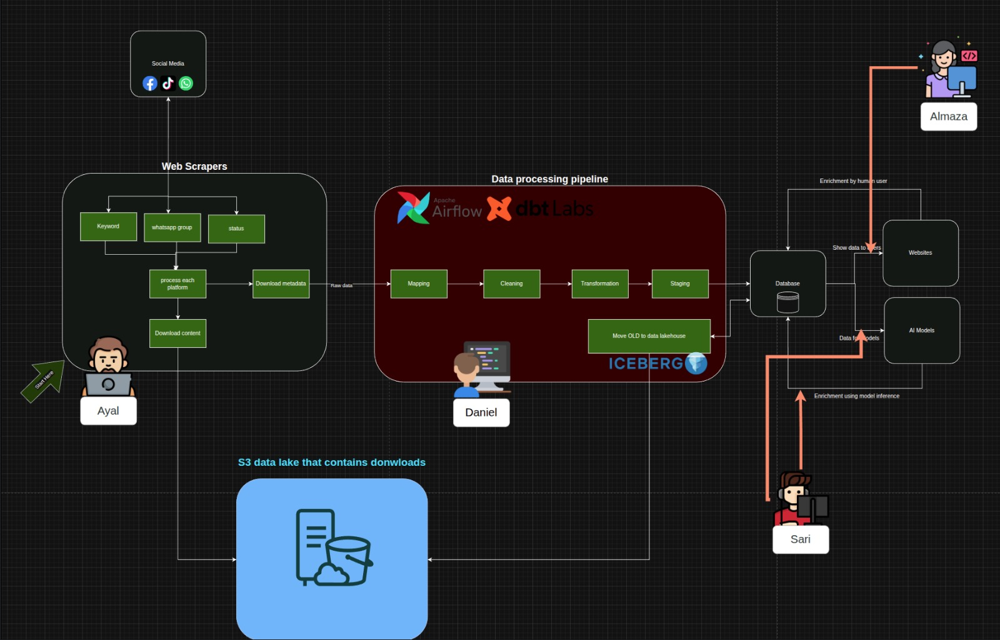
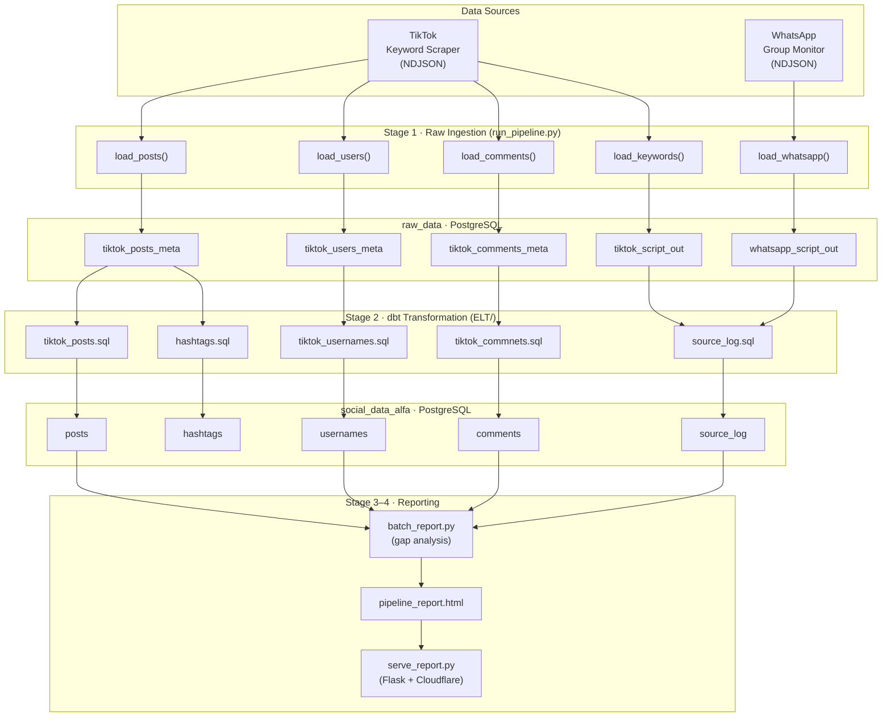
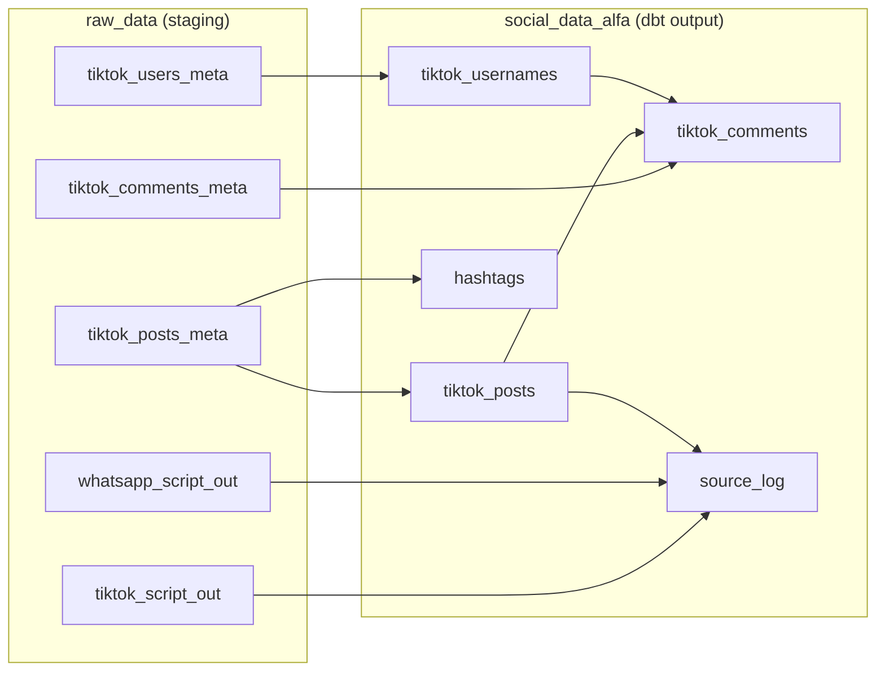
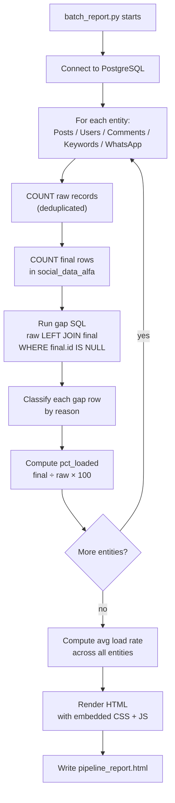
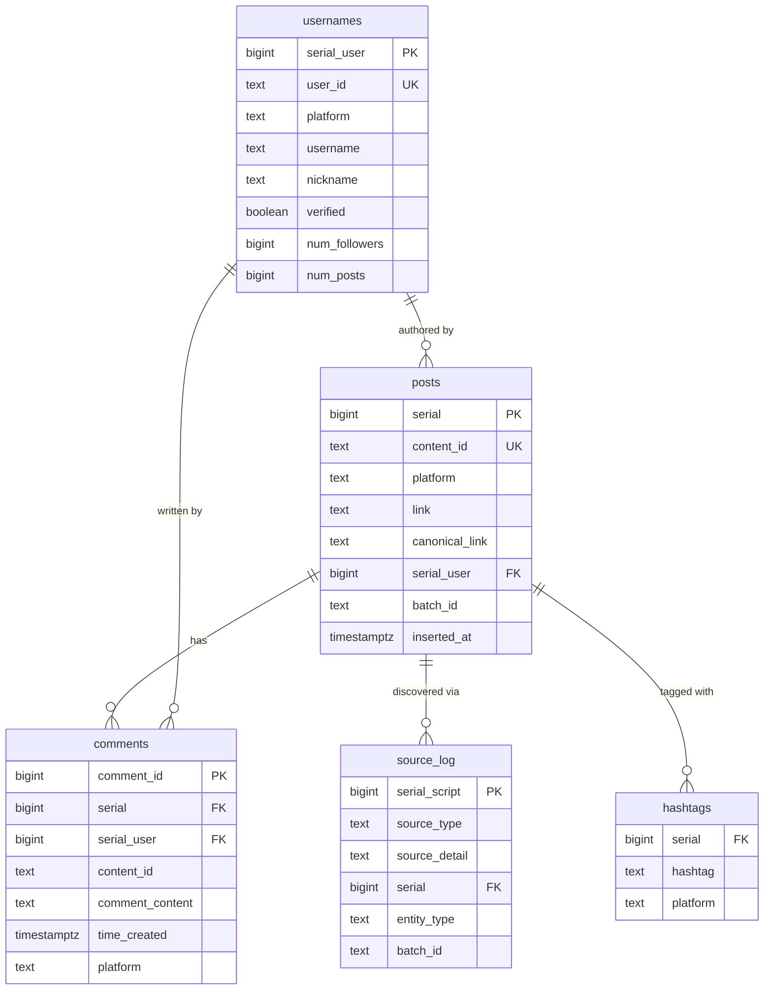

# NetShield Intelligence Pipeline

> End-to-end data pipeline for ingesting, transforming, and monitoring TikTok and WhatsApp social-media intelligence data.

## Live Reports → [elt-1cd.pages.dev](https://elt-1cd.pages.dev)
View all reports in your browser — no login, no cloning needed. Updates automatically on every push.

---



---

## Table of Contents

1. [Overview](#overview)
2. [Architecture](#architecture)
3. [Data Sources](#data-sources)
4. [Project Structure](#project-structure)
5. [Pipeline Stages](#pipeline-stages)
   - [Stage 1 — Raw Ingestion](#stage-1--raw-ingestion)
   - [Stage 2 — dbt Transformation](#stage-2--dbt-transformation)
   - [Stage 3 — Gap Analysis Report](#stage-3--gap-analysis-report)
   - [Stage 4 — Report Server](#stage-4--report-server)
6. [Database Schema](#database-schema)
   - [raw\_data (staging)](#raw_data-staging)
   - [social\_data\_alfa (final)](#social_data_alfa-final)
7. [Entity Relationship Diagram](#entity-relationship-diagram)
8. [Data Quality Tests](#data-quality-tests)
9. [Gap Analysis Report](#gap-analysis-report)
10. [Running the Pipeline](#running-the-pipeline)

---

## Overview

The NetShield pipeline collects social-media content from two collection channels — a **TikTok keyword scraper** and a **WhatsApp forwarding monitor** — and loads all raw signals into a PostgreSQL database. A **dbt** transformation layer then deduplicates, resolves foreign keys, and produces a clean analytical schema. A purpose-built **gap analysis report** is generated after every run and can be shared publicly as a password-protected web page.


---

## Architecture



---

## Data Sources

| Source | Format | Folder | Content |
|---|---|---|---|
| TikTok Posts | NDJSON | `tiktok_post_meta_data/` | Post metadata, engagement counters, content type |
| TikTok Users | NDJSON | `tiktok_useres_meta/` | Creator profiles, follower counts, verification status |
| TikTok Comments | NDJSON | `tiktok_comments_meta/` | Comment text, likes, reply count, parent post id |
| Keyword Script Output | NDJSON | `tiktok_keywords_out/` | Links found by keyword search with search term |
| WhatsApp Script Output | NDJSON | `whatsapp_script_out/` | Links shared in monitored WhatsApp groups |

All source files follow the **NDJSON** format (one JSON object per line), written by the respective scraping scripts on a rolling basis. Multiple batch files per source type accumulate over time — the loaders process all of them in a single run.

---

## Project Structure

```
netshield-pipeline/
│
├── run_pipeline.py              ← Pipeline entry-point
├── .env                         ← DB credentials + report auth
├── README.md
│
├── Loading_to_postgress/
│   └── loading_raw_data/        ← Raw-data loader scripts + source NDJSON files
│       ├── core_loader.py
│       ├── comments_loading.py
│       ├── links_loading.py
│       ├── tiktok_keywords_loading.py
│       ├── useres_loading.py
│       ├── whatsapp_script_loading.py
│       ├── resolve_canonical_links.py
│       ├── tiktok_post_meta_data/
│       ├── tiktok_useres_meta/
│       ├── tiktok_comments_meta/
│       ├── tiktok_keywords_out/
│       └── whatsapp_script_out/
│
├── reports/                     ← Gap-analysis report + public web server
│   ├── batch_report.py
│   ├── serve_report.py
│   ├── cloudflared.exe
│   └── pipeline_report.html
│
├── ELT/                         ← dbt project (netshield_pipeline)
│   ├── dbt_project.yml
│   ├── packages.yml
│   └── models/
│       └── staging/
│           └── tiktok/
│               ├── tiktok_posts.sql
│               ├── tiktok_usernames.sql
│               ├── tiktok_commnets.sql
│               ├── source_log.sql
│               ├── hashtags.sql
│               └── schema.yml
│
└── netsheild_data/              ← Reference CSV exports
```

---

## Pipeline Stages

### Stage 1 — Raw Ingestion

`run_pipeline.py` orchestrates five sequential loaders. Each loader:
1. Reads every NDJSON file in its source directory
2. Maps each JSON record to a flat row via a `_map_*()` function
3. Bulk-inserts into the corresponding `raw_data.*` table using `core_loader.py`

The `raw_data` schema is **fully rebuilt on every run** (`DROP TABLE IF EXISTS` + `CREATE TABLE`), guaranteeing a clean slate.

```mermaid
sequenceDiagram
    participant M   as run_pipeline.py
    participant CL  as core_loader.py
    participant DB  as PostgreSQL
    participant dbt as dbt

    rect rgb(30, 40, 60)
        Note over M,DB: Stage 1 — Raw Ingestion (raw_data schema rebuilt from scratch)
        loop for each of 5 loaders
            M->>DB: DROP + CREATE table
            M->>CL: load *.ndjson files
            CL-->>DB: INSERT batched rows
        end
    end

    rect rgb(30, 60, 40)
        Note over M,dbt: Stage 2 — dbt Transformation
        M->>dbt: dbt run
        dbt-->>DB: MERGE into social_data_alfa.*
    end

    rect rgb(60, 40, 30)
        Note over M: Stage 3 — Report
        M->>M: batch_report.generate_report()
    end
```



#### Key mapping logic

| Entity | ID extraction strategy | Short URL handling |
|---|---|---|
| Posts | `content_id_text` field → fallback regex `/(?:video\|photo)/(\d{10,20})/` on `link` | `vt.tiktok.com` links with no extractable ID are stored with `content_id_text = NULL` and surface as gaps in the report |
| Users | `id` field cast to text | N/A |
| Comments | `comment_id` field cast to bigint | N/A |
| Keywords | `link` field pass-through | Short-URL detection deferred to report gap analysis |
| WhatsApp | `link` field pass-through | Same |

---

### Stage 2 — dbt Transformation

dbt reads from `raw_data` and writes to `social_data_alfa` using **incremental merge** strategies. All models use deterministic surrogate keys — no database sequences — so they are safe to full-refresh at any time.



#### Surrogate key strategy

| Model | Key | Method |
|---|---|---|
| `posts` | `serial` | `CAST(content_id AS BIGINT)` — TikTok's own video ID, globally unique |
| `usernames` | `serial_user` | `nextval(sequence)` on first insert; preserved on subsequent merges |
| `comments` | `comment_id` | Natural key from TikTok API |
| `source_log` | `serial_script` | `ABS(MD5(source_type \|\| serial \|\| source_detail))::BIGINT` — deterministic, no sequence needed |

---

### Stage 3 — Gap Analysis Report

After every dbt run, `batch_report.py` queries both schemas and computes, for each entity type:

- **Raw count** — distinct records in the staging table (deduplicated by business key)
- **Final count** — rows in the `social_data_alfa` table
- **Load rate** — `final / raw × 100`
- **Gap rows** — raw records with no matching final row (LEFT JOIN, capped at 500 per entity)
- **Gap reason** — categorised explanation for each missing record



The report is a **fully self-contained HTML file** — all CSS, JavaScript, and CSV data are embedded inline.

#### Gap reason taxonomy

| Entity | Gap reason | Meaning |
|---|---|---|
| Posts | `short URL — no video ID in link` | `vt.tiktok.com` / `vm.tiktok.com` link — content ID cannot be extracted |
| Posts | `link could not be parsed — no content ID extracted` | Non-short-URL link whose path didn't match `/video/` or `/photo/` |
| Posts | `post not in dbt output` | content_id present in raw but dbt did not produce a row |
| Users | `not found in usernames` | user_id exists in raw but missing from final |
| Comments | `parent post not scraped` | comment's parent post_id not in `posts` |
| Comments | `parent post exists, comment not loaded` | parent known, comment itself dropped |
| Keywords | `short URL — no video ID in link` | short link, no match possible |
| Keywords | `post not scraped` | full URL present but no post loaded for that video ID |
| Keywords | `post loaded, not in source_log` | post exists but link not matched in source_log |
| WhatsApp | `out of scope: facebook link` | non-TikTok link in WhatsApp group |
| WhatsApp | `out of scope: instagram link` | same |

---

### Stage 4 — Report Server

The Flask-based report server exposes the latest HTML report via a Cloudflare Tunnel, password-protected. A `/refresh` endpoint regenerates the report live from the database without restarting the server.

---

## Database Schema

### raw\_data (staging)

Rebuilt completely on every pipeline run. Serves as a clean landing zone.

| Table | Key columns | Description |
|---|---|---|
| `tiktok_posts_meta` | `content_id_text`, `platform`, `link`, `canonical_link` | Raw post metadata including engagement counters |
| `tiktok_users_meta` | `user_id`, `platform`, `username` | Raw creator profiles |
| `tiktok_comments_meta` | `comment_id`, `content_id`, `platform` | Raw comments with parent post reference |
| `tiktok_script_out` | `link`, `term`, `canonical_link` | Links collected by the keyword scraping script |
| `whatsapp_script_out` | `link`, `sent_by`, `group`, `canonical_link` | Links shared in monitored WhatsApp groups |

### social\_data\_alfa (final)

Managed by dbt. Incrementally merged; safe to full-refresh.

| Table | Primary key | Description |
|---|---|---|
| `posts` | `serial` (bigint) | Deduplicated TikTok posts |
| `usernames` | `serial_user` (bigint) | Deduplicated creator profiles |
| `comments` | `comment_id` (bigint) | Comments with FK to posts |
| `source_log` | `serial_script` (bigint) | Maps each post to how it was discovered |
| `hashtags` | `(serial, hashtag)` | Exploded hashtag dimension |

---

## Entity Relationship Diagram



---

## Data Quality Tests

dbt schema tests run after every transformation via `dbt test`. Current status: **43 PASS, 1 WARN**.

| Model | Test | Expected | Notes |
|---|---|---|---|
| `posts` | `serial` unique | PASS | |
| `posts` | `serial` not_null | PASS | |
| `posts` | `content_id` unique | PASS | |
| `posts` | `platform` accepted_values | PASS | Only `'tiktok'` allowed |
| `posts` | `link` not_null | WARN | Short-URL posts have no resolvable link |
| `posts` | `batch_id` not_null | PASS | |
| `usernames` | `serial_user` unique + not_null | PASS | |
| `usernames` | `user_id` not_null | PASS | |
| `usernames` | `username` not_null | PASS | |
| `comments` | `comment_id` unique + not_null | PASS | |
| `comments` | `serial` not_null | PASS | |
| `comments` | `serial` → `posts.serial` FK | PASS | |
| `source_log` | `serial_script` unique + not_null | PASS | |

---

## Running the Pipeline

### Prerequisites

- Python 3.11+
- PostgreSQL running on `localhost:5432`
- dbt-postgres installed

### Full pipeline run

```bash
python run_pipeline.py
```

This will:
1. Drop and recreate all `raw_data` tables
2. Load all NDJSON files from all source directories
3. Run `dbt run` to populate `social_data_alfa`
4. Generate `reports/pipeline_report.html`
5. Open the report in your browser

### Run individual stages

```bash
# dbt only:
cd ELT
dbt run

# Full rebuild of all dbt tables:
dbt run --full-refresh

# Regenerate report only:
python reports/batch_report.py
```

---

*NetShield Intelligence Pipeline — dbt project: `netshield_pipeline`*
